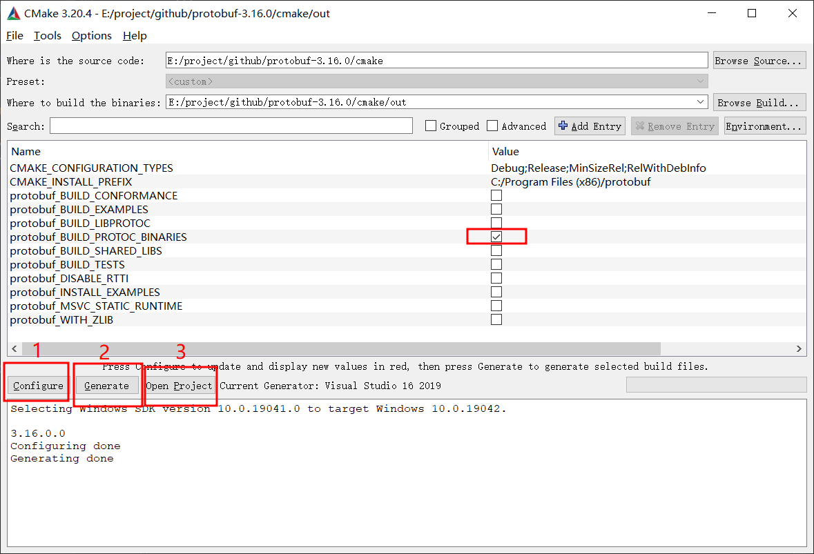

protoc编译
===================================================
概述
--------
lua中proto解析使用的lua-protobuf，命名规则使用默认proto文件里的，但是C#版本命名规则会自动转换成Camel命名，二边不一致。为了方便emmylua使用C#类来当提示，需要去掉生成C#代码的Camel命名，只有文件名字保留Camel命名

代码修改
--------
版本：[protobuf-csharp-3.6.1.zip](https://github.com/protocolbuffers/protobuf/releases/download/v3.16.0/protobuf-csharp-3.16.0.zip)

**csharp_helpers.h新增**
```c++
std::string UnderscoresToCamelCase1(const std::string& input,
                                   bool cap_next_letter,
                                   bool preserve_period);
```
                                   
**csharp_helpers.cc**
```c++
GetFileNameBase()
    return UnderscoresToCamelCase1(StripDotProto(base), true, false);
    // return UnderscoresToPascalCase(StripDotProto(base));

// 默认去掉转换
std::string UnderscoresToCamelCase(const std::string& input,
                                   bool cap_next_letter,
                                   bool preserve_period) {
    return input;                         
}

// UnderscoresToCamelCase1=原来的UnderscoresToCamelCase的实现
std::string UnderscoresToCamelCase1(const std::string& input,
                                   bool cap_next_letter,
                                   bool preserve_period) {
    ...
}
```

编译
---
mac
---
```msbuild
brew install autoconf automake libtool

git clone https://github.com/google/protobuf.git
cd protobuf
./autogen.sh
./configure --disable-shared
make
make install
```

win
---
使用cmake导出vs工程，使用vs2019编译protoc.exe


参考
---
https://www.jianshu.com/p/93aeae0d78e5  
https://www.jianshu.com/p/f806faef245f  
https://blog.csdn.net/dai_jing/article/details/83010324
